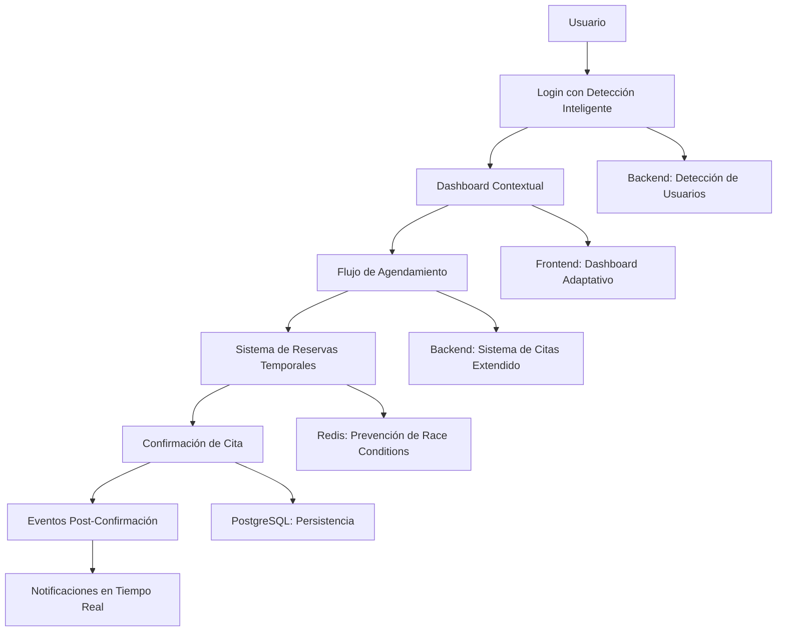
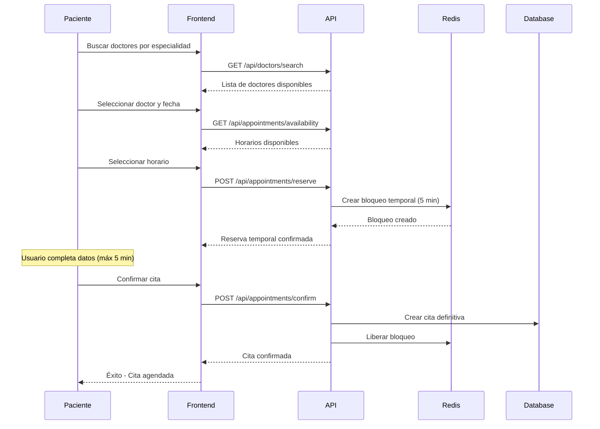

# SMD VITAL - Sistema Integrado de Dashboard Contextual y Agendamiento Inteligente

## 📋 Resumen Ejecutivo

Este documento describe la implementación del **Sistema Integrado de Dashboard Contextual y Agendamiento Inteligente** para SMD VITAL, construido sobre la base del sistema existente de citas médicas. El sistema proporciona una experiencia personalizada y fluida para todos los tipos de usuarios.

## 🏗️ Arquitectura del Sistema Integrado

### **Componentes Principales**



## 🔧 **1. Dashboard Contextual**

### **Características Principales**

- **Detección Automática**: Identifica el tipo de usuario (doctor, enfermero, paciente, admin)
- **Widgets Personalizados**: Muestra información relevante según el rol
- **Acciones Rápidas**: Botones de acceso directo a funcionalidades clave
- **Actualización en Tiempo Real**: Datos siempre actualizados

### **Implementación Frontend**

```typescript
// Componente principal del dashboard
const ContextualDashboard = () => {
  const { userDetection, getContextualDashboard } = useAuth();
  
  // Cargar datos personalizados según el tipo de usuario
  const loadDashboardData = async () => {
    const response = await dashboardService.getContextualDashboard(
      token, 
      userDetection, 
      { force_refresh: true }
    );
  };
  
  // Renderizar widgets según el tipo de usuario
  const renderWidgets = () => {
    return dashboardData.widgets.map(widget => 
      renderWidget(widget)
    );
  };
};
```

### **Tipos de Dashboard por Usuario**

| Tipo de Usuario | Widgets Principales | Acciones Rápidas |
|------------------|---------------------|------------------|
| **Paciente** | Próximas Citas, Agendar Cita, Expedientes | Agendar, Ver Historial, Ver Recetas |
| **Doctor** | Agenda del Día, Cola de Pacientes, Estadísticas | Iniciar Cita, Ver Pacientes, Crear Receta |
| **Enfermero** | Pacientes Asignados, Tareas de Signos Vitales | Tomar Signos, Actualizar Paciente |
| **Admin** | Resumen del Sistema, Aprobaciones, Reportes | Gestionar Usuarios, Ver Reportes |

## 🎯 **2. Flujo de Agendamiento Inteligente**

### **Proceso de Agendamiento**



### **Prevención de Race Conditions**

#### **Estrategia de Bloqueo Distribuido**

```python
# Backend: Crear reserva temporal
async def create_temporary_reservation(doctor_id, slot_datetime, patient_id):
    # 1. Adquirir bloqueo en Redis
    availability_key = f"slot_availability:{doctor_id}:{slot_datetime.isoformat()}"
    lock_acquired = await redis.set(availability_key, patient_id, nx=True, ex=300)
    
    if not lock_acquired:
        return {"error": "Horario no disponible - ya está siendo reservado"}
    
    # 2. Verificar en base de datos
    existing = await check_existing_appointment(doctor_id, slot_datetime)
    if existing:
        await redis.delete(availability_key)
        return {"error": "Horario ya está ocupado"}
    
    # 3. Crear reserva temporal
    reservation = create_reservation(doctor_id, slot_datetime, patient_id)
    
    # 4. Programar limpieza automática
    schedule_cleanup(reservation.id)
    
    return {"success": True, "reservation_id": reservation.id}
```

#### **Frontend: Manejo de Estado**

```typescript
// Hook para manejo de agendamiento
const useAppointmentBooking = () => {
  const [state, setState] = useState({
    step: 'search',
    selectedDoctor: null,
    selectedSlot: null,
    reservation: null,
    loading: false,
    error: null
  });

  const reserveSlot = async (doctorId, slot) => {
    const response = await appointmentBookingService.createTemporaryReservation({
      doctor_id: doctorId,
      slot_datetime: slot.toISO(),
      patient_id: currentUser.id
    });
    
    if (response.success) {
      setState(prev => ({
        ...prev,
        step: 'confirm',
        reservation: response.data
      }));
      
      // Iniciar countdown visual
      startReservationCountdown(response.data.expires_at);
    }
  };
};
```

## 🔄 **3. Sistema de Eventos Post-Confirmación**

### **Eventos Automáticos**

Cuando se confirma una cita, el sistema dispara automáticamente:

1. **Actualización del Dashboard del Paciente**
   - Nueva cita aparece en "Próximas Citas"
   - Estadísticas actualizadas

2. **Notificación al Doctor**
   - Notificación en tiempo real
   - Email de confirmación
   - Actualización de agenda

3. **Gestión de Pagos** (si aplica)
   - Crear intención de pago
   - Redirigir a pasarela de pago
   - Actualizar estado de la cita

4. **Auditoría y Logging**
   - Registrar evento en logs
   - Actualizar métricas del sistema

### **Implementación de Eventos**

```python
# Backend: Disparar eventos post-confirmación
async def trigger_post_confirmation_events(appointment):
    events = [
        update_patient_dashboard(appointment.patient_id),
        notify_doctor(appointment.doctor_id, appointment),
        send_confirmation_email(appointment.patient_id),
        update_system_metrics(appointment),
        log_appointment_created(appointment)
    ]
    
    await asyncio.gather(*events, return_exceptions=True)
```

## 📊 **4. Métricas y Monitoreo**

### **KPIs del Sistema**

| Métrica | Descripción | Objetivo |
|---------|-------------|----------|
| **Tiempo de Detección** | Latencia promedio de detección de usuario | < 500ms |
| **Precisión de Detección** | % de usuarios redirigidos correctamente | > 95% |
| **Tiempo de Agendamiento** | Tiempo promedio para agendar una cita | < 2 minutos |
| **Race Conditions** | Número de conflictos de horarios | < 1% |
| **Satisfacción del Usuario** | Feedback sobre la experiencia | > 4.5/5 |

### **Logging y Auditoría**

```python
# Ejemplo de log estructurado
{
  "timestamp": "2024-01-15T10:30:00Z",
  "event_type": "appointment_confirmed",
  "user_id": "uuid",
  "user_type": "patient",
  "appointment_id": "uuid",
  "doctor_id": "uuid",
  "slot_datetime": "2024-01-20T14:00:00Z",
  "processing_time_ms": 150,
  "reservation_duration_seconds": 180
}
```

## 🚀 **5. Guía de Implementación**

### **Paso 1: Configuración del Backend**

```bash
# 1. Instalar dependencias adicionales
pip install redis

# 2. Configurar Redis en docker-compose.yml
redis:
  image: redis:alpine
  ports:
    - "6379:6379"

# 3. Actualizar variables de entorno
REDIS_URL=redis://redis:6379/0
ENABLE_USER_DETECTION=true
```

### **Paso 2: Configuración del Frontend**

```bash
# 1. Instalar dependencias
npm install

# 2. Configurar variables de entorno
REACT_APP_API_BASE_URL=http://localhost:8000
REACT_APP_ENABLE_USER_DETECTION=true
```

### **Paso 3: Migración de Datos**

```sql
-- No se requieren migraciones adicionales
-- El sistema se integra con las tablas existentes
```

### **Paso 4: Testing**

```bash
# Backend
cd smd-vital-backend
python -m pytest tests/test_user_detection.py -v
python -m pytest tests/test_reservation_service.py -v

# Frontend
cd horizon-ui-chakra-main
npm test -- --coverage
```

## 🔧 **6. Configuración Avanzada**

### **Personalización por Especialidad Médica**

```typescript
// Ejemplo: Dashboard para cardiólogos
const cardiologyWidgets = [
  {
    id: 'ecg_monitor',
    title: 'Monitor ECG',
    type: 'ecg_widget',
    specialty: 'cardiologia'
  },
  {
    id: 'heart_rate_trends',
    title: 'Tendencias Cardíacas',
    type: 'chart_widget',
    specialty: 'cardiologia'
  }
];
```

### **Configuración de Caché**

```python
# TTL diferenciado por tipo de usuario
CACHE_TTL = {
    'patient': 300,    # 5 minutos
    'doctor': 60,      # 1 minuto
    'nurse': 120,      # 2 minutos
    'admin': 180       # 3 minutos
}
```

## 🛠️ **7. Mantenimiento y Soporte**

### **Monitoreo en Producción**

```yaml
# docker-compose.yml - Servicios de monitoreo
services:
  prometheus:
    image: prom/prometheus
    ports:
      - "9090:9090"
  
  grafana:
    image: grafana/grafana
    ports:
      - "3000:3000"
```

### **Logs Estructurados**

```python
# Configuración de logging
LOGGING_CONFIG = {
    'version': 1,
    'handlers': {
        'file': {
            'class': 'logging.handlers.RotatingFileHandler',
            'filename': '/var/log/smd-vital/appointments.log',
            'maxBytes': 10485760,  # 10MB
            'backupCount': 5
        }
    },
    'loggers': {
        'appointment_service': {
            'level': 'INFO',
            'handlers': ['file']
        }
    }
}
```

## 📈 **8. Roadmap y Mejoras Futuras**

### **Fase 1 (Actual)**
- ✅ Dashboard contextual básico
- ✅ Sistema de reservas temporales
- ✅ Detección de usuarios
- ✅ Prevención de race conditions

### **Fase 2 (Próxima)**
- 🔄 Machine Learning para mejorar detección
- 🔄 Análisis de comportamiento del usuario
- 🔄 Notificaciones push en tiempo real
- 🔄 Integración con calendarios externos

### **Fase 3 (Futuro)**
- 📋 IA para recomendaciones de horarios
- 📋 Integración con sistemas de pago avanzados
- 📋 Análisis predictivo de demanda
- 📋 Optimización automática de horarios

## 🎯 **9. Beneficios del Sistema Integrado**

### **Para Pacientes**
- **Experiencia Personalizada**: Dashboard adaptado a sus necesidades
- **Agendamiento Fluido**: Proceso simple y sin conflictos
- **Información Relevante**: Solo ve lo que necesita ver

### **Para Personal Médico**
- **Vista Especializada**: Información específica por especialidad
- **Gestión Eficiente**: Herramientas optimizadas para su rol
- **Notificaciones Inteligentes**: Alertas relevantes y oportunas

### **Para Administradores**
- **Visión Completa**: Dashboard con métricas del sistema
- **Control Total**: Herramientas de gestión avanzadas
- **Monitoreo en Tiempo Real**: Estado del sistema siempre visible

### **Para el Negocio**
- **Mayor Eficiencia**: Reducción de tiempo en agendamiento
- **Mejor Experiencia**: Usuarios más satisfechos
- **Escalabilidad**: Sistema preparado para crecimiento
- **Datos Valiosos**: Métricas para toma de decisiones

---

**SMD VITAL** - Sistema Integrado v1.0  
*Construido sobre la base sólida del sistema existente, mejorando la experiencia de todos los usuarios*
