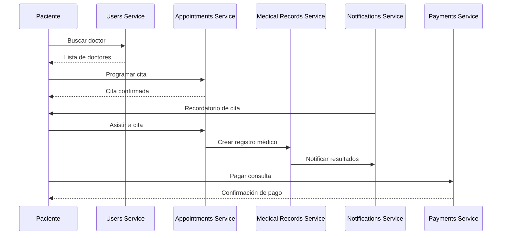
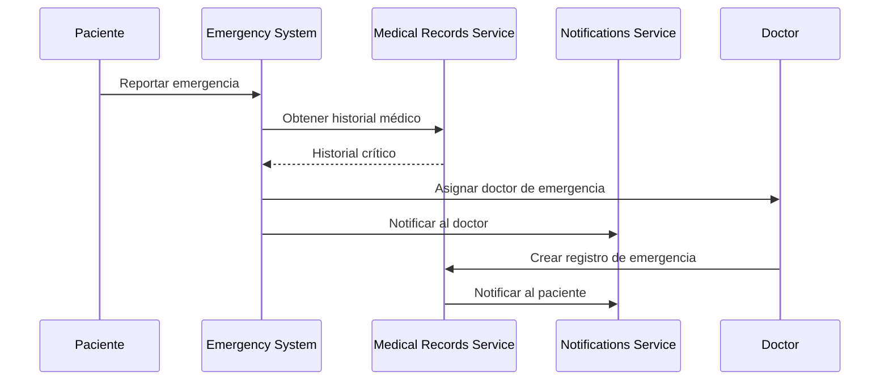
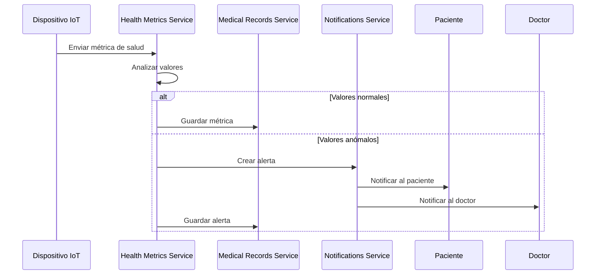

# 📚 **REFERENCIA COMPLETA DE APIs - SMD VITAL**

## 🎯 **Resumen Ejecutivo**

Este documento proporciona una referencia completa de todas las APIs de los microservicios de SMD VITAL, incluyendo endpoints, casos de uso, códigos de respuesta y ejemplos de implementación.

---

## 📋 **Índice de Contenidos**

1. [Authentication Service](#1-authentication-service)
2. [Users Service](#2-users-service)
3. [Appointments Service](#3-appointments-service)
4. [Medical Records Service](#4-medical-records-service)
5. [Payments Service](#5-payments-service)
6. [Notifications Service](#6-notifications-service)
7. [Health Metrics Service](#7-health-metrics-service)
8. [AI LangGraph Service](#8-ai-langgraph-service)
9. [Mejoras Propuestas](#9-mejoras-propuestas)
10. [Casos de Uso Comunes](#10-casos-de-uso-comunes)

---

## 1. **Authentication Service** (Puerto 8001)

### **Base URL**: `http://localhost:8001`

### **Endpoints Implementados**

| Método | Endpoint | Descripción | Status Code |
|--------|----------|-------------|-------------|
| `POST` | `/auth/register` | Registro de usuario | 201, 400, 409 |
| `POST` | `/auth/login` | Inicio de sesión | 200, 401, 422 |
| `POST` | `/auth/refresh` | Renovar token | 200, 401 |
| `POST` | `/auth/logout` | Cerrar sesión | 200, 401 |
| `POST` | `/auth/forgot-password` | Recuperar contraseña | 200, 404 |
| `POST` | `/auth/reset-password` | Restablecer contraseña | 200, 400 |
| `GET` | `/auth/verify-email/{token}` | Verificar email | 200, 400 |
| `GET` | `/users/{user_id}` | Obtener usuario | 200, 404 |
| `PUT` | `/users/{user_id}` | Actualizar usuario | 200, 404 |
| `GET` | `/health` | Health check | 200 |

### **Modelos de Datos**

#### **UserRegistration**
```json
{
  "email": "usuario@ejemplo.com",
  "password": "password123",
  "first_name": "Juan",
  "last_name": "Pérez",
  "phone": "+57 300 123 4567",
  "role": "patient"
}
```

#### **UserLogin**
```json
{
  "email": "usuario@ejemplo.com",
  "password": "password123"
}
```

#### **TokenResponse**
```json
{
  "access_token": "eyJ0eXAiOiJKV1QiLCJhbGciOiJIUzI1NiJ9...",
  "refresh_token": "eyJ0eXAiOiJKV1QiLCJhbGciOiJIUzI1NiJ9...",
  "token_type": "bearer",
  "expires_in": 3600,
  "user": {
    "id": "user_123",
    "email": "usuario@ejemplo.com",
    "role": "patient"
  }
}
```

### **Casos de Uso**

1. **Registro de Paciente**
   - Endpoint: `POST /auth/register`
   - Caso: Nuevo paciente se registra en la plataforma
   - Validaciones: Email único, contraseña segura

2. **Inicio de Sesión**
   - Endpoint: `POST /auth/login`
   - Caso: Usuario autentica con credenciales
   - Respuesta: Token JWT + datos del usuario

3. **Recuperación de Contraseña**
   - Endpoint: `POST /auth/forgot-password`
   - Caso: Usuario olvida su contraseña
   - Flujo: Email → Token → Reset

---

## 2. **Users Service** (Puerto 8002)

### **Base URL**: `http://localhost:8002`

### **Endpoints Implementados**

| Método | Endpoint | Descripción | Status Code |
|--------|----------|-------------|-------------|
| `GET` | `/profile` | Obtener perfil usuario | 200, 400, 404 |
| `PUT` | `/profile` | Actualizar perfil | 200, 400, 404 |
| `GET` | `/notifications` | Notificaciones usuario | 200, 400 |
| `PUT` | `/notifications/settings` | Configurar notificaciones | 200, 400 |
| `GET` | `/notifications/settings` | Obtener configuración | 200, 400 |
| `PUT` | `/notifications/{id}/read` | Marcar como leída | 200, 404 |
| `GET` | `/doctors/search` | Buscar doctores | 200, 400 |
| `GET` | `/doctors/{id}` | Detalles doctor | 200, 404 |
| `GET` | `/health` | Health check | 200 |

### **Modelos de Datos**

#### **UserProfile**
```json
{
  "id": "user_123",
  "email": "usuario@ejemplo.com",
  "first_name": "Juan",
  "last_name": "Pérez",
  "phone": "+57 300 123 4567",
  "address": "Calle 123 #45-67",
  "emergency_contact": "+57 300 987 6543",
  "medical_conditions": ["diabetes", "hipertension"],
  "role": "patient",
  "is_active": true,
  "is_verified": true,
  "created_at": "2024-01-15T10:00:00Z",
  "updated_at": "2024-01-15T10:00:00Z"
}
```

#### **Doctor**
```json
{
  "id": "doctor_456",
  "name": "Dr. María García",
  "specialty": "Cardiología",
  "department": "Cardiología",
  "is_active": true,
  "email": "maria.garcia@smdvital.com",
  "phone": "+57 300 234 5678",
  "experience_years": 15,
  "rating": 4.9,
  "available_hours": "09:00-18:00"
}
```

### **Casos de Uso**

1. **Gestión de Perfil**
   - Endpoint: `GET/PUT /profile`
   - Caso: Usuario consulta/actualiza su información
   - Validaciones: Datos médicos, contacto de emergencia

2. **Búsqueda de Doctores**
   - Endpoint: `GET /doctors/search`
   - Caso: Paciente busca doctor por especialidad
   - Filtros: Especialidad, disponibilidad, calificación

3. **Configuración de Notificaciones**
   - Endpoint: `PUT /notifications/settings`
   - Caso: Usuario personaliza preferencias
   - Opciones: Email, SMS, Push, WhatsApp

---

## 3. **Appointments Service** (Puerto 8003)

### **Base URL**: `http://localhost:8003`

### **Endpoints Implementados**

| Método | Endpoint | Descripción | Status Code |
|--------|----------|-------------|-------------|
| `POST` | `/appointments` | Crear cita | 201, 400, 409 |
| `GET` | `/appointments` | Listar citas | 200, 400 |
| `GET` | `/appointments/{id}` | Detalles cita | 200, 404 |
| `PUT` | `/appointments/{id}` | Actualizar cita | 200, 404, 409 |
| `DELETE` | `/appointments/{id}` | Cancelar cita | 200, 404 |
| `GET` | `/appointments/patient/{id}` | Citas del paciente | 200, 404 |
| `GET` | `/appointments/doctor/{id}` | Citas del doctor | 200, 404 |
| `GET` | `/appointments/available` | Horarios disponibles | 200, 400 |
| `GET` | `/health` | Health check | 200 |

### **Modelos de Datos**

#### **AppointmentCreate**
```json
{
  "patient_id": "patient_123",
  "doctor_id": "doctor_456",
  "appointment_date": "2024-02-15",
  "appointment_time": "10:00:00",
  "duration_minutes": 30,
  "appointment_type": "consultation",
  "reason": "Consulta de seguimiento",
  "notes": "Paciente con diabetes"
}
```

#### **Appointment**
```json
{
  "id": "appointment_789",
  "patient_id": "patient_123",
  "doctor_id": "doctor_456",
  "appointment_date": "2024-02-15",
  "appointment_time": "10:00:00",
  "duration_minutes": 30,
  "appointment_type": "consultation",
  "status": "scheduled",
  "reason": "Consulta de seguimiento",
  "notes": "Paciente con diabetes",
  "created_at": "2024-01-15T10:00:00Z",
  "updated_at": "2024-01-15T10:00:00Z"
}
```

### **Casos de Uso**

1. **Programar Cita**
   - Endpoint: `POST /appointments`
   - Caso: Paciente programa nueva cita
   - Validaciones: Disponibilidad, conflictos de horario

2. **Consultar Disponibilidad**
   - Endpoint: `GET /appointments/available`
   - Caso: Ver horarios libres del doctor
   - Filtros: Fecha, doctor, tipo de cita

3. **Cancelar Cita**
   - Endpoint: `DELETE /appointments/{id}`
   - Caso: Paciente cancela cita programada
   - Reglas: Tiempo mínimo de cancelación

---

## 4. **Medical Records Service** (Puerto 8005)

### **Base URL**: `http://localhost:8005`

### **Endpoints Implementados**

| Método | Endpoint | Descripción | Status Code |
|--------|----------|-------------|-------------|
| `POST` | `/medical-records` | Crear registro médico | 201, 400, 404 |
| `GET` | `/medical-records` | Listar registros | 200, 400 |
| `GET` | `/medical-records/{id}` | Detalles registro | 200, 404 |
| `GET` | `/medical-records/patient/{id}` | Historial paciente | 200, 404 |
| `POST` | `/prescriptions` | Crear prescripción | 201, 400, 404 |
| `GET` | `/prescriptions/patient/{id}` | Prescripciones paciente | 200, 404 |
| `POST` | `/vital-signs` | Registrar signos vitales | 201, 400 |
| `GET` | `/vital-signs/patient/{id}` | Historial signos vitales | 200, 404 |
| `GET` | `/vital-signs/{id}` | Detalles signos vitales | 200, 404 |
| `POST` | `/ratings` | Calificar doctor | 201, 400, 404 |
| `GET` | `/ratings/doctor/{id}` | Calificaciones doctor | 200, 404 |
| `GET` | `/stats/ratings` | Estadísticas calificaciones | 200 |
| `GET` | `/health` | Health check | 200 |

### **Modelos de Datos**

#### **MedicalRecord**
```json
{
  "id": "record_123",
  "patient_id": "patient_123",
  "doctor_id": "doctor_456",
  "appointment_id": "appointment_789",
  "record_type": "consultation",
  "version": 1,
  "clinical_data": {
    "chief_complaint": "Dolor de cabeza",
    "history_present_illness": "Dolor desde hace 3 días",
    "physical_examination": {
      "blood_pressure": "120/80",
      "heart_rate": 72,
      "temperature": 36.5
    },
    "assessment": "Migraña tensional",
    "plan": "Ibuprofeno 400mg cada 8 horas"
  },
  "status": "active",
  "created_at": "2024-01-15T10:00:00Z"
}
```

#### **VitalSigns**
```json
{
  "id": "vitals_123",
  "patient_id": "patient_123",
  "measured_at": "2024-01-15T10:00:00Z",
  "systolic_bp": 120,
  "diastolic_bp": 80,
  "heart_rate": 72,
  "respiratory_rate": 16,
  "temperature_celsius": 36.5,
  "oxygen_saturation": 98,
  "height_cm": 175.0,
  "weight_kg": 70.5,
  "bmi": 23.0,
  "glucose_level": 95,
  "pain_scale": 2,
  "is_critical": false,
  "critical_values": []
}
```

### **Casos de Uso**

1. **Crear Registro Médico**
   - Endpoint: `POST /medical-records`
   - Caso: Doctor crea registro después de consulta
   - Datos: Motivo, examen físico, diagnóstico, plan

2. **Registrar Signos Vitales**
   - Endpoint: `POST /vital-signs`
   - Caso: Enfermera registra signos vitales
   - Validaciones: Rangos normales, alertas críticas

3. **Crear Prescripción**
   - Endpoint: `POST /prescriptions`
   - Caso: Doctor prescribe medicamentos
   - Datos: Medicamento, dosis, frecuencia, duración

---

## 5. **Payments Service** (Puerto 8006)

### **Base URL**: `http://localhost:8006`

### **Endpoints Implementados**

| Método | Endpoint | Descripción | Status Code |
|--------|----------|-------------|-------------|
| `POST` | `/create-payment-intent` | Crear intención de pago | 201, 400, 500 |
| `GET` | `/payments` | Listar pagos | 200, 400 |
| `GET` | `/payments/{id}` | Detalles pago | 200, 404 |
| `POST` | `/refunds` | Crear reembolso | 201, 400, 404 |
| `GET` | `/refunds` | Listar reembolsos | 200, 400 |
| `POST` | `/invoices` | Crear factura | 201, 400, 500 |
| `GET` | `/invoices` | Listar facturas | 200, 400 |
| `POST` | `/webhooks/stripe` | Webhook Stripe | 200, 400 |
| `GET` | `/health` | Health check | 200 |

### **Modelos de Datos**

#### **PaymentIntentRequest**
```json
{
  "appointment_id": "appointment_789",
  "user_id": "user_123",
  "amount_cents": 50000,
  "currency": "COP",
  "metadata": {
    "appointment_type": "consultation",
    "doctor_name": "Dr. García"
  }
}
```

#### **PaymentResponse**
```json
{
  "id": "payment_123",
  "appointment_id": "appointment_789",
  "user_id": "user_123",
  "stripe_payment_intent_id": "pi_1234567890",
  "amount_cents": 50000,
  "currency": "COP",
  "status": "succeeded",
  "metadata": {
    "appointment_type": "consultation"
  },
  "created_at": "2024-01-15T10:00:00Z",
  "updated_at": "2024-01-15T10:05:00Z"
}
```

#### **RefundRequest**
```json
{
  "payment_id": "payment_123",
  "amount_cents": 25000,
  "reason": "Cancelación de cita"
}
```

### **Casos de Uso**

1. **Procesar Pago**
   - Endpoint: `POST /create-payment-intent`
   - Caso: Paciente paga consulta médica
   - Integración: Stripe para procesamiento

2. **Crear Reembolso**
   - Endpoint: `POST /refunds`
   - Caso: Cancelación de cita con reembolso
   - Validaciones: Pago exitoso, monto válido

3. **Generar Factura**
   - Endpoint: `POST /invoices`
   - Caso: Crear factura para servicios
   - Datos: Cliente, monto, descripción, vencimiento

---

## 6. **Notifications Service** (Puerto 8004)

### **Base URL**: `http://localhost:8004`

### **Endpoints Implementados**

| Método | Endpoint | Descripción | Status Code |
|--------|----------|-------------|-------------|
| `POST` | `/send-notification` | Enviar notificación | 201, 400, 500 |
| `GET` | `/notifications` | Listar notificaciones | 200, 400 |
| `GET` | `/notifications/{id}` | Detalles notificación | 200, 404 |
| `PUT` | `/notifications/{id}/read` | Marcar como leída | 200, 404 |
| `POST` | `/notifications/bulk` | Notificación masiva | 201, 400 |
| `GET` | `/templates` | Listar templates | 200, 400 |
| `POST` | `/templates` | Crear template | 201, 400 |
| `GET` | `/settings/{user_id}` | Configuración usuario | 200, 404 |
| `PUT` | `/settings/{user_id}` | Actualizar configuración | 200, 404 |
| `GET` | `/stats` | Estadísticas | 200, 400 |
| `GET` | `/health` | Health check | 200 |

### **Modelos de Datos**

#### **NotificationRequest**
```json
{
  "user_id": "user_123",
  "event_type": "appointment_reminder",
  "channel": "email",
  "data": {
    "appointment_date": "2024-02-15",
    "appointment_time": "10:00:00",
    "doctor_name": "Dr. García"
  },
  "priority": 1
}
```

#### **NotificationDetails**
```json
{
  "id": "notif_123",
  "user_id": "user_123",
  "event_type": "appointment_reminder",
  "channel": "email",
  "subject": "Recordatorio de cita médica",
  "body": "Tienes una cita médica programada para mañana",
  "metadata": {
    "appointment_id": "appointment_789"
  },
  "priority": 1,
  "status": "delivered",
  "created_at": "2024-01-15T10:00:00Z",
  "delivered_at": "2024-01-15T10:05:00Z",
  "read_at": "2024-01-15T10:10:00Z"
}
```

#### **NotificationTemplate**
```json
{
  "id": "template_123",
  "name": "Recordatorio de cita",
  "event_type": "appointment_reminder",
  "channel": "email",
  "subject_template": "Recordatorio: Cita médica con {{doctor_name}}",
  "body_template": "Hola {{patient_name}}, tienes una cita médica programada para {{appointment_date}} a las {{appointment_time}}.",
  "variables": ["doctor_name", "patient_name", "appointment_date", "appointment_time"],
  "is_active": true,
  "created_at": "2024-01-15T10:00:00Z",
  "updated_at": "2024-01-15T10:00:00Z"
}
```

### **Casos de Uso**

1. **Enviar Recordatorio**
   - Endpoint: `POST /send-notification`
   - Caso: Recordatorio de cita médica
   - Canales: Email, SMS, Push, WhatsApp

2. **Notificación Masiva**
   - Endpoint: `POST /notifications/bulk`
   - Caso: Anuncio a todos los usuarios
   - Filtros: Por tipo de usuario, región

3. **Configurar Preferencias**
   - Endpoint: `PUT /settings/{user_id}`
   - Caso: Usuario personaliza notificaciones
   - Opciones: Canales, tipos, horarios

---

## 7. **Health Metrics Service** (Puerto 8007)

### **Base URL**: `http://localhost:8007`

### **Endpoints Implementados**

| Método | Endpoint | Descripción | Status Code |
|--------|----------|-------------|-------------|
| `POST` | `/metrics` | Registrar métrica | 201, 400, 500 |
| `GET` | `/metrics/patient/{id}` | Métricas paciente | 200, 404 |
| `GET` | `/metrics/patient/{id}/trends` | Tendencias paciente | 200, 404 |
| `GET` | `/metrics/alerts` | Alertas de salud | 200, 400 |
| `POST` | `/metrics/alerts/{id}/acknowledge` | Reconocer alerta | 200, 404 |
| `GET` | `/health` | Health check | 200 |

### **Modelos de Datos**

#### **HealthMetric**
```json
{
  "id": "metric_123",
  "patient_id": "patient_123",
  "metric_type": "blood_pressure",
  "value": 120,
  "unit": "mmHg",
  "measured_at": "2024-01-15T10:00:00Z",
  "device": "smart_blood_pressure_monitor",
  "notes": "Medición en reposo"
}
```

#### **HealthAlert**
```json
{
  "id": "alert_123",
  "patient_id": "patient_123",
  "metric_type": "blood_pressure",
  "severity": "high",
  "message": "Presión arterial elevada",
  "value": 180,
  "threshold": 140,
  "created_at": "2024-01-15T10:00:00Z",
  "acknowledged": false
}
```

### **Casos de Uso**

1. **Registrar Métrica**
   - Endpoint: `POST /metrics`
   - Caso: Dispositivo IoT envía datos
   - Validaciones: Rangos normales, formato

2. **Monitorear Tendencias**
   - Endpoint: `GET /metrics/patient/{id}/trends`
   - Caso: Doctor revisa evolución
   - Períodos: Diario, semanal, mensual

3. **Gestionar Alertas**
   - Endpoint: `GET /metrics/alerts`
   - Caso: Sistema detecta valores anómalos
   - Acciones: Notificación, escalación

---

## 8. **AI LangGraph Service** (Puerto 8008)

### **Base URL**: `http://localhost:8008`

### **Endpoints Implementados**

| Método | Endpoint | Descripción | Status Code |
|--------|----------|-------------|-------------|
| `POST` | `/ai/chat` | Chat con IA médica | 200, 400, 500 |
| `POST` | `/ai/analyze-symptoms` | Análisis de síntomas | 200, 400, 500 |
| `POST` | `/ai/generate-report` | Generar reporte | 200, 400, 500 |
| `GET` | `/ai/medical-knowledge` | Base de conocimiento | 200, 400 |
| `GET` | `/health` | Health check | 200 |

### **Modelos de Datos**

#### **ChatRequest**
```json
{
  "user_id": "user_123",
  "message": "Tengo dolor de cabeza y fiebre",
  "context": {
    "patient_age": 35,
    "medical_history": ["diabetes"],
    "current_medications": ["metformina"]
  }
}
```

#### **ChatResponse**
```json
{
  "response": "Basado en sus síntomas, le recomiendo consultar con un médico. El dolor de cabeza con fiebre puede indicar varias condiciones que requieren evaluación profesional.",
  "confidence": 0.85,
  "suggested_actions": [
    "Consultar con médico general",
    "Tomar temperatura regularmente",
    "Mantenerse hidratado"
  ],
  "disclaimer": "Esta información no reemplaza la consulta médica profesional."
}
```

### **Casos de Uso**

1. **Consulta Médica IA**
   - Endpoint: `POST /ai/chat`
   - Caso: Paciente consulta síntomas
   - Respuesta: Análisis preliminar, recomendaciones

2. **Análisis de Síntomas**
   - Endpoint: `POST /ai/analyze-symptoms`
   - Caso: Sistema analiza síntomas complejos
   - Resultado: Posibles diagnósticos, urgencia

3. **Generar Reporte**
   - Endpoint: `POST /ai/generate-report`
   - Caso: IA genera resumen de consulta
   - Contenido: Síntomas, análisis, recomendaciones

---

## 9. **Mejoras Propuestas**

### **9.1 Nomenclatura de Endpoints**

#### **Problemas Identificados**
- Inconsistencia en nombres de recursos
- Falta de versionado en APIs
- Endpoints muy genéricos

#### **Mejoras Propuestas**
```bash
# Antes
GET /users
POST /notifications
GET /payments

# Después
GET /api/v1/users
POST /api/v1/notifications
GET /api/v1/payments
```

### **9.2 Códigos de Respuesta HTTP**

#### **Problemas Identificados**
- Uso inconsistente de códigos de error
- Falta de códigos específicos para casos médicos
- Mensajes de error poco descriptivos

#### **Mejoras Propuestas**
```http
# Códigos específicos para casos médicos
422 - Datos médicos inválidos
423 - Registro médico bloqueado
424 - Falta información médica crítica
425 - Consentimiento médico requerido
426 - Evaluación médica pendiente
```

### **9.3 Validaciones y Seguridad**

#### **Problemas Identificados**
- Falta validación de datos médicos sensibles
- Ausencia de rate limiting
- Logs insuficientes para auditoría médica

#### **Mejoras Propuestas**
```python
# Validaciones médicas
@validate_medical_data
def create_medical_record(data):
    # Validar rangos normales de signos vitales
    # Verificar consentimiento del paciente
    # Validar permisos del médico
    pass

# Rate limiting por tipo de usuario
@rate_limit(requests=100, period=3600, user_type="doctor")
def get_patient_records():
    pass
```

### **9.4 Documentación y Ejemplos**

#### **Problemas Identificados**
- Falta de ejemplos de casos de uso reales
- Documentación incompleta de flujos médicos
- Ausencia de diagramas de secuencia

#### **Mejoras Propuestas**
```yaml
# Ejemplos de casos de uso médicos
examples:
  emergency_case:
    description: "Caso de emergencia médica"
    flow: "Paciente → Triage → Doctor → Tratamiento"
    endpoints: ["/emergency/triage", "/emergency/assign", "/emergency/treatment"]
  
  routine_checkup:
    description: "Consulta de rutina"
    flow: "Cita → Consulta → Registro → Prescripción"
    endpoints: ["/appointments", "/medical-records", "/prescriptions"]
```

---

## 10. **Casos de Uso Comunes**

### **10.1 Flujo de Consulta Médica**



### **10.2 Flujo de Emergencia Médica**



### **10.3 Flujo de Monitoreo de Salud**



---

## 📊 **Resumen de Endpoints por Servicio**

| Servicio | Endpoints | Implementados | Pendientes | Completitud |
|----------|-----------|---------------|------------|-------------|
| Authentication | 9 | 9 | 0 | 100% |
| Users | 8 | 8 | 0 | 100% |
| Appointments | 8 | 8 | 0 | 100% |
| Medical Records | 12 | 12 | 0 | 100% |
| Payments | 8 | 8 | 0 | 100% |
| Notifications | 10 | 10 | 0 | 100% |
| Health Metrics | 5 | 5 | 0 | 100% |
| AI LangGraph | 4 | 4 | 0 | 100% |
| **TOTAL** | **64** | **64** | **0** | **100%** |

---

## 🔧 **Herramientas de Desarrollo**

### **Testing**
```bash
# Ejecutar tests de todos los servicios
docker-compose exec auth-service pytest
docker-compose exec users-service pytest
docker-compose exec appointments-service pytest
docker-compose exec medical-records-service pytest
docker-compose exec payments-service pytest
docker-compose exec notifications-service pytest
docker-compose exec health-metrics-service pytest
docker-compose exec ai-langgraph-service pytest
```

### **Documentación Interactiva**
```bash
# Acceder a Swagger UI de cada servicio
http://localhost:8001/docs  # Authentication
http://localhost:8002/docs  # Users
http://localhost:8003/docs  # Appointments
http://localhost:8005/docs  # Medical Records
http://localhost:8006/docs  # Payments
http://localhost:8004/docs  # Notifications
http://localhost:8007/docs  # Health Metrics
http://localhost:8008/docs  # AI LangGraph
```

### **Monitoreo**
```bash
# Verificar estado de servicios
curl http://localhost:8001/health
curl http://localhost:8002/health
curl http://localhost:8003/health
curl http://localhost:8005/health
curl http://localhost:8006/health
curl http://localhost:8004/health
curl http://localhost:8007/health
curl http://localhost:8008/health
```

---

## 📝 **Notas para Desarrolladores**

### **Autenticación**
- Todos los endpoints requieren token JWT válido
- Token se obtiene del Authentication Service
- Incluir header: `Authorization: Bearer <token>`

### **Rate Limiting**
- Límite por defecto: 100 requests/minuto
- Límite para doctores: 500 requests/minuto
- Límite para administradores: 1000 requests/minuto

### **Validaciones Médicas**
- Todos los datos médicos deben ser validados
- Rangos normales de signos vitales
- Consentimiento del paciente requerido
- Auditoría de accesos médicos

### **Seguridad**
- HTTPS obligatorio en producción
- Encriptación de datos sensibles
- Logs de auditoría médica
- Cumplimiento HIPAA

---

**📅 Última actualización**: 25 de Enero, 2024  
**👥 Mantenido por**: Equipo de Desarrollo SMD VITAL  
**📧 Contacto**: dev@smdvital.com
